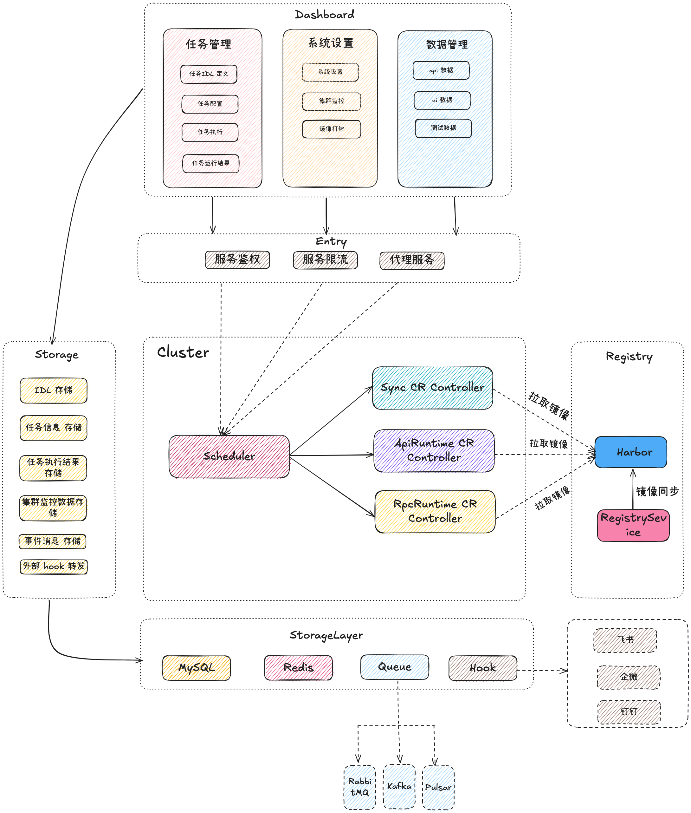
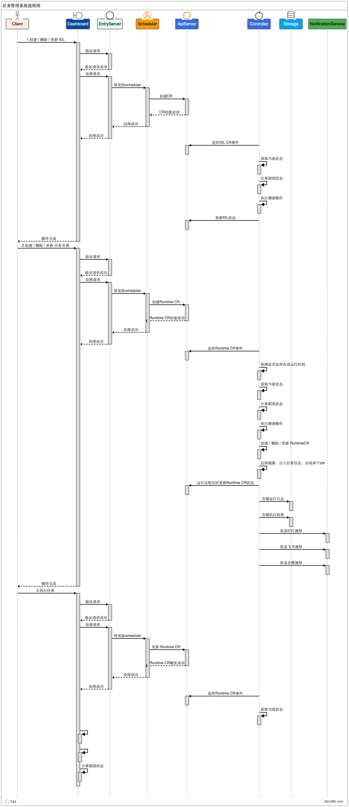

# KubeInspect

<!--  -->

  

# 基于云原生的新一代测试平台 - 让测试更简单

## 📖 简介

KubeInspect 是一个基于云原生架构的现代化测试平台，旨在革新传统测试方式。通过声明式配置和直观的操作界面，我们致力于降低测试门槛，使所有人都能轻松实现自动化测试，不再依赖专业测试人员。

### ✨ 核心特性

- 🚀 **声明式配置**: 简单直观的界面操作，来快速定义和生成测试任务的配置
- 🎯 **易于上手**: 零门槛学习曲线，人性化的操作界面
- 🔌 **扩展性强**: 插件化架构，轻松扩展新功能
- ☁️ **云原生支持**: 基于 Kubernetes 构建，天然支持分布式部署
- 🔄 **持续集成**: 无缝对接 CI/CD 流程
- 📊 **可视化报告**: 直观的测试报告和数据分析

## 🏗️ 系统架构

## 🔄 流程图

### 核心组件

- **Dashboard** - 前端可视化系统
  - 数据管理
    - 接口数据
        - api 文档
        - rpc 服务接口
        - ....
    - UI页面数据
        - 组件数据
        - 页面布局
        - ....
    - 测试数据
        - 用于测试的数据(动态生成)
  - 任务管理
    - 元数据(IDL)配置
    - 任务配置文件的动态生成
    - 任务的执行
    - 任务监控
    - 测试报告
  - 系统管理
    - 集群状态监控
    - 镜像打包
    - 系统配置
- **Storage** - 后端数据存储服务
  - 作为一个数据中转站
  - 存储任务数据
    - 任务元数据
    - 任务配置信息
    - 任务执行结果
  - 集群指标存储
  - 消息hook转发
  - 系统配置

- **Entry** - 集群入口组件
  - 接收业务系统的请求并转发给调度器
  - 负载均衡
  - API 网关

- **Scheduler** - 集群调度器
  - 和 k8s 交互
  - 调度entry 传过来的任务,调用 k8s api,创建对应的 CR
    - Sync CR
    - ApiRuntime CR
    - UIRuntime CR
    - RpcRuntime CR
    - LoadTest CR
    - ChaosEngine CR
    - ....
- **Registry** - 任务运行镜像仓库
  - 任务运行脚本的镜像仓库
  - 支持多语言,版本控制
  - 打包部署到 Harbor 仓库

- **Core** - 集群核心控制器
  - CR 的生命周期管理, 状态同步
    - Sync CR
        - 同步api 文档
        - 同步rpc 服务接口
    - ApiRuntime CR
        - 执行一次 api 测试任务的Pipeline
        - 分布式并发执行
        - 执行结果和状态同步
        - 消息通知
    - ....

## 🔗 组件地址

- **Entry**
  - https://github.com/linxs953/SI_Entry

- **Storage** 
  - https://github.com/linxs953/SI_Storage

- **Scheduler**
  - https://github.com/linxs953/SI_Scheduler

- **Registry**
  - https://github.com/linxs953/SI_Registry

- **Core**
  - https://github.com/linxs953/SI_Core
